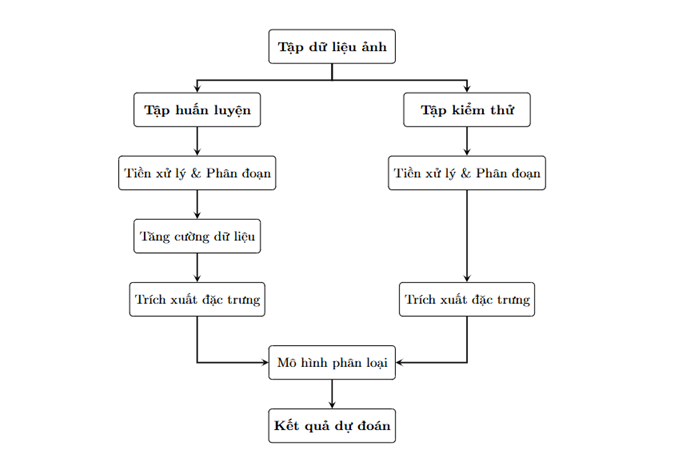
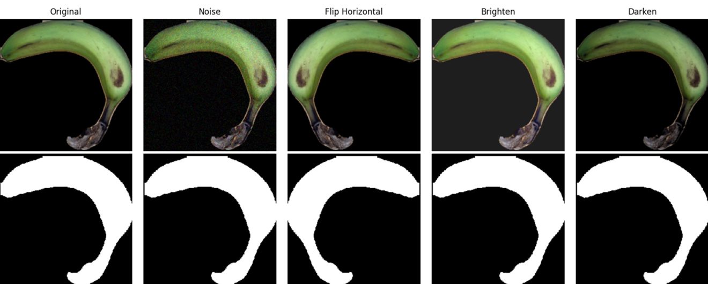

# Classification of Banana Ripeness Based on Color Features

Phân Loại Độ Chín Của Chuối dựa Trên Đặc Trưng Màu Sắc

---

## Tổng quan quy trình

Quy trình được thực hiện một cách tuần tự theo hình trên, bắt đầu từ tập dữ liệu ảnh đầu vào cho đến khi đưa
ra kết quả dự đoán cuối cùng. Cụ thể các bước như sau:

* **Chia tập dữ liệu**: Tập dữ liệu ảnh ban đầu được phân chia thành 2 loại: Tập huấn luyện và Tập kiểm thử, theo tỷ lệ 8:2.

* **Tiền xử lý & Phân đoạn** : Cả hai nhánh dữ liệu đều trải qua bước này. Tại đây, mô hình YOLOv8x-seg
được ứng dụng để phân đoạn chính xác đối tượng, sau đó toàn bộ ảnh được điều chỉnh kích thước đồng nhất
về 224 × 224 pixel.

* **Xử lý chuyên biệt và Trích xuất đặc trưng**:

– Đối với Tập huấn luyện: Hình ảnh sau khi phân đoạn sẽ được tăng cường dữ liệu nhằm tăng tính
đa dạng cho tập mẫu, giảm thiểu tình trạng overfitting. Sau đó, ảnh được đưa vào bước trích xuất đặc
trưng.

– Đối với Tập kiểm thử: Hình ảnh được đưa trực tiếp vào bước trích xuất đặc trưng mà không cần qua
khâu tăng cường dữ liệu.

* **Mô hình phân loại**: Các đặc trưng sau khi được trích xuất từ cả hai tập sẽ được đưa vào mô hình phân
loại. Ở giai đoạn này, thuật toán KNN (K-Nearest Neighbors) được sử dụng để học các đặc trưng và đưa ra
kết quả dự đoán cuối cùng về độ chín của chuối.

---

## Methodology

Our feature extraction pipeline involves a fusion of spatial and statistical color data:

1. **Background Subtraction:** Segmenting the banana from the background using a custom mask.
2. **CCV Masking:** Applying Color Coherence Vector logic to divide the banana mask into **Coherent** and **Incoherent** regions.

3. **Feature Fusion:** Computing **Color Moments** (Mean, Std, Skewness) on both Coherent and Incoherent masks, resulting in a robust **18-dimensional feature vector**.

4. **Classification:** Utilizing **KNN** (Optimized via GridSearchCV) to classify the ripeness levels.

---

## Evaluation Results

The model was optimized using **GridSearchCV** with $k$-fold cross-validation ($k=7$).

| Metric | Validation Set | Test Set |
| :--- | :---: | :---: |
| **Accuracy** | **0.78** | **0.83** |

**Best Hyperparameters:**
* `n_neighbors`: 5
* `metric`: 'manhattan'
* `weights`: 'distance'

---